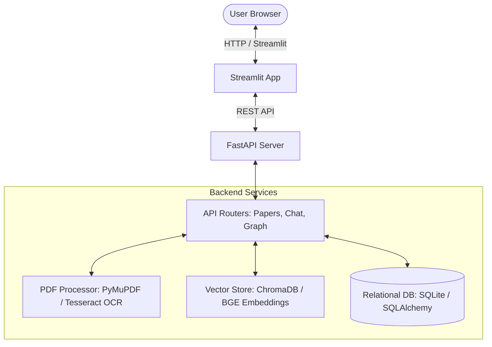

# 🎓 Semantic Research Paper Assistant

An intelligent, two-tier Retrieval-Augmented Generation (RAG) application designed for academic research analysis, interactive Q&A, metadata extraction, bibliography parsing, and document comparison.

This system runs **100% locally and offline** by default using CPU-based sentence embeddings and local semantic extraction rules, with an optional upgrade to generative models (Google Gemini or OpenAI GPT) when API keys are configured.

---

## 🌟 Key Features

* **Interactive Chat Q&A**: Ask detailed questions about single or multiple uploaded papers with precise inline source and page number citations (e.g., `[Source #1] Page 4`).
* **Multi-Format Ingestion**: Auto-extracts metadata and bibliography lists from PDFs using `PyMuPDF`. Includes a **Tesseract OCR** fallback for scanned tables and low-text documents.
* **Local Offline Heuristics**: Extracted section summaries (Abstract, Contributions, Methodology, Limitations) and comparative matrices are calculated instantly without external APIs or usage costs.
* **Interactive Comparison Matrix**: Dynamically query and display structural elements of selected papers side-by-side.
* **Robust Database Integration**: Integrates SQLite via SQLAlchemy ORM to manage paper schemas, session history, and extracted knowledge entities with relational delete cascades.
* **CI/CD Pipeline**: Configured with automated unit tests for PDF processors and citation formatting running on GitHub Actions.

---

## 🏗️ Architecture & Technologies

The application is split into a high-performance REST API backend and a clean, responsive web interface:



* **Frontend**: Streamlit, custom CSS, Python Requests.
* **Backend**: FastAPI, SQLAlchemy ORM, Uvicorn.
* **Vector Store**: ChromaDB, HuggingFace Sentence-Transformers (`BAAI/bge-small-en-v1.5` on CPU).
* **Database**: SQLite (`local_db.sqlite`).
* **CI/CD**: GitHub Actions, Pytest.

---

## 🚀 Getting Started

### Prerequisites

Ensure you have the following installed on your machine:
* Python 3.10 or higher
* Tesseract OCR (for scanned PDF extraction)
* Git

### Installation & Setup

1. **Clone the repository**:
   ```bash
   git clone https://github.com/AbdulRahim-G/Semantic_Research--paper_Assistant.git
   cd Semantic_Research--paper_Assistant
   ```

2. **Create and activate a virtual environment**:
   ```bash
   # On Windows (PowerShell)
   python -m venv venv
   .\venv\Scripts\Activate.ps1
   
   # On Linux/macOS
   python -m venv venv
   source venv/bin/activate
   ```

3. **Install Dependencies**:
   ```bash
   pip install -r backend/requirements.txt
   pip install -r frontend/requirements.txt
   ```

4. **Environment Variables**:
   Copy the example environment file and configure keys if desired (optional):
   ```bash
   cp .env.example .env
   ```
   *Note: If no API keys are provided in `.env`, the system automatically activates local fallback search, comparison, and summarization engines.*

---

## 🏃 Running the Application

Ensure your virtual environment is active before running the servers.

### 1. Start the Backend API
Run the backend runner script from the project root:
```bash
python run_backend.py
```
* **API Documentation**: Once running, open [http://localhost:8000/docs](http://localhost:8000/docs) to explore the FastAPI Swagger UI.
* *Note: The first startup takes ~35 seconds on CPU to download and load the BGE embedding weights.*

### 2. Start the Frontend UI
In a separate terminal (with the virtual environment active), run:
```bash
streamlit run frontend/app.py --server.port=8501
```
Open [http://localhost:8501](http://localhost:8501) in your browser to start exploring your research paper library.

---

## 🧪 Testing

Automated tests reside in `backend/tests/`. To run the unit tests:
```bash
pytest backend/tests/
```
These tests validate metadata and clean-text rules as well as APA, MLA, and IEEE citation outputs.
